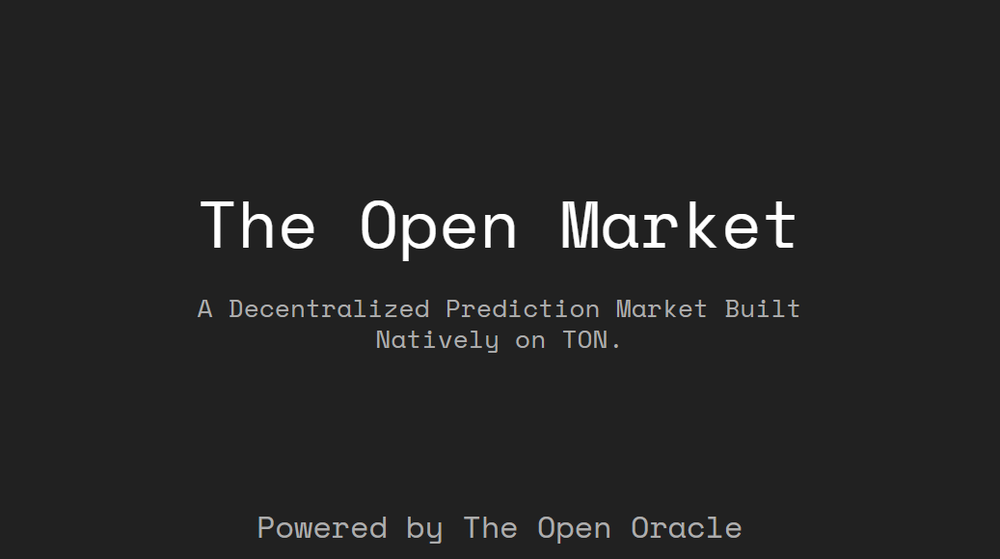

# TOM Contracts



> Smart-contract backbone for **TOM – The Open Market**.  
> A TON-native, fully-on-chain prediction market that lives inside Telegram.  
> Trade “YES/NO” on real-world events without ever leaving your chat.

🔗 **Jump straight to the mini-app:** https://t.me/opn_mkt/trade

---

## TL;DR for the battle-scarred dev

-   **Language**: Tact (because life is too short for FunC foot-guns).
-   **AMM**: Constant-product under the hood – every trade moves price, no order book drama.
-   **Oracle**: Plug-in TOO (The Open Oracle) – one line to swap out data sources.
-   **UX**: Telegram Mini-App – grandma-friendly, still hardcore DeFi under the sheets.
-   **Cheat codes**:
    ```bash
    npx blueprint build   # compile
    npx blueprint test    # 21 tests, all green ✔
    npx blueprint run     # deploy / seed / whatever
    ```

---

## Repo anatomy

```
tom_contract
├── contracts
│   └── factory.tact          # Factory + BinaryMarket (Tact, ~400 LOC, 0 warnings)
├── wrappers                  # ton-core wrappers & serde helpers
├── tests
│   └── Factory.spec.ts       # tests,
├── scripts
│   ├── deployMarket.ts       # Deploy the factory once
│   └── createMarket.ts       # Spin up demo markets (5 spicy questions ready to go)
└── README.md                 # you're soaking in it
```

---

## Quick start – from zero to “I just made a market”

### 1. Clone & install

```bash
git clone git@github.com:johntad110/tom_contracts.git
cd tom_contract
yarn        # or npm i – I don't judge
```

### 2. Build

```bash
npx blueprint build
```

### 3. Test

```bash
npx blueprint test
```

Expect green across the board. If anything is red, buy more RAM.

### 4. Deploy the factory

```bash
npx blueprint run deployMarket
```

Grab the address, feed it to `createMarket.ts` if you want demo markets.

### 5. Create your first market (optional demo)

```bash
npx blueprint run createMarket
```

This script fires five markets into the chain – from “Will TON hit $8.50?” to “Tap-to-Earn 1 M DAU?”.  
Use them as reference or delete them and craft your own.

---

## Deeper dive – contracts worth stealing from

### Factory (`factory.tact`)

-   One global singleton.
-   Keeps an ever-increasing `nextMarketId`.
-   Creates `BinaryMarket` instances via `CreateMarket` message.
-   Owner-only `Withdraw` because rent isn’t free.
-   Admin knobs left stubbed for governance upgrades.

### BinaryMarket

The real meat:

| Feature         | Notes                                                                                                                              |
| --------------- | ---------------------------------------------------------------------------------------------------------------------------------- |
| **AMM pricing** | Constant-product (`k = reserveYes * reserveNo`). Fees skimmed on every trade.                                                      |
| **Shares**      | Internal maps `yesBalances` / `noBalances`, no extra jettons – keeps gas low.                                                      |
| **Resolution**  | Oracle-signed `Resolve` message triggers instant payout loop. MVP style; will migrate to pull-pattern `Redeem` for main-net scale. |
| **Edge cases**  | Re-entrancy-safe, integer overflow-proof, and grumpy require-statements everywhere.                                                |

---

## Scripts you’ll actually use

-   `deployMarket.ts` – Deploys the factory once.
-   `createMarket.ts` – Batch-creates markets with sensible defaults (0.1 TON liquidity, 2 % fee).  
    Tweak the `markets` array and rerun as needed.

---

## Tests worth reading

`tests/Factory.spec.ts` covers:

-   Happy path (deploy, create, trade, resolve).
-   Sad path (insufficient liquidity, bad probability, oracle spoofing).
-   Gas snapshots so you can brag on Twitter.

---

## Adding your own contract

```bash
npx blueprint create MyAwesomeContract
```

Scaffolds `.tact`, wrapper, and an empty test file. Fill in the blanks, push, open PR.

---

## Roadmap (a.k.a. the TODO comments)

-   [ ] Pull-based `Redeem` (gas-efficient).
-   [ ] Configurable protocol fee split.
-   [ ] Factory admin functions (setMinLiquidity, setOwner).
-   [ ] Upgrade path to `TON-20` shares for composability.

---

## License

MIT – copy, paste, ship, repeat.

---

Questions? Hit the Telegram mini-app or open an issue.  
Code speaks louder than docs, but docs keep the auditors happy.  
Now go build the future of prediction markets. 🍻
